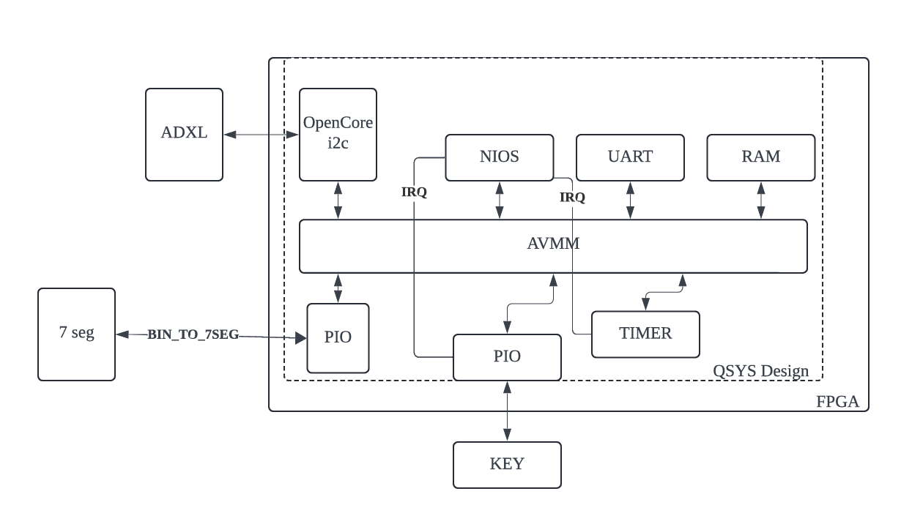
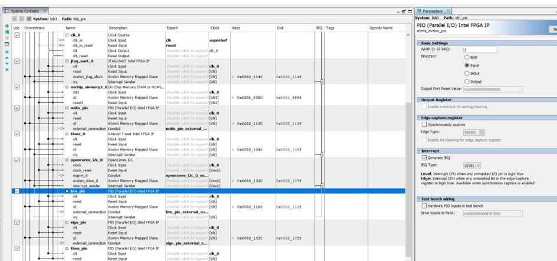
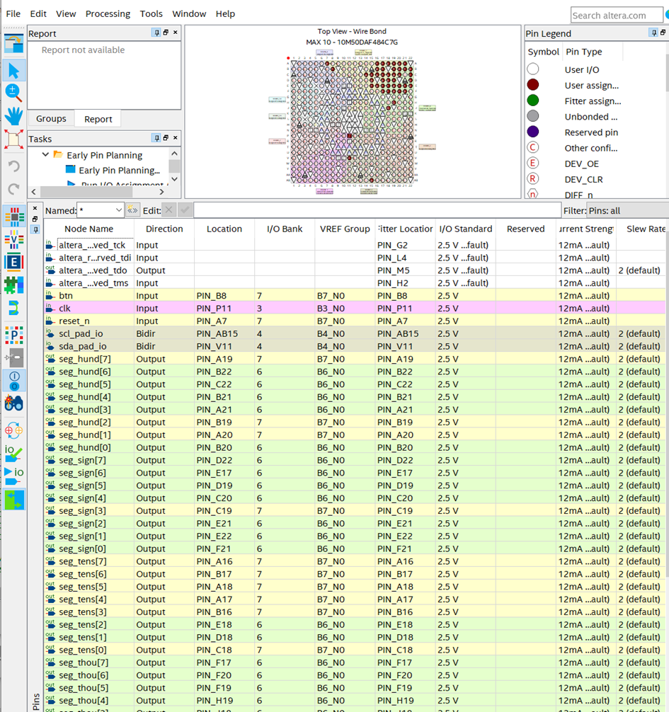
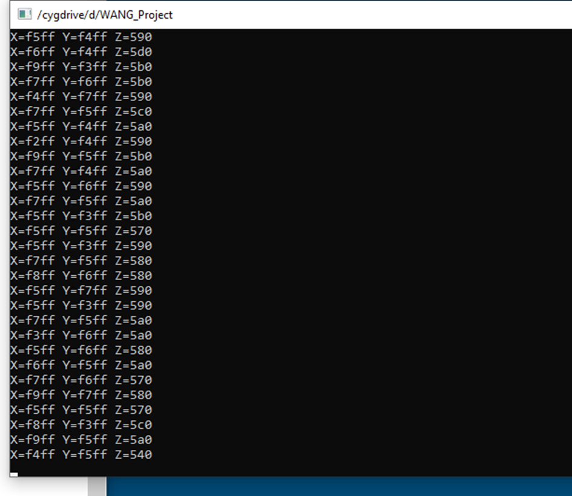

# WANG_Project

## 1. **Décrire l’architecture du système**

### **Sélection des composants QSYS**

- **Processeur Nios II** (peut utiliser `nios2_gen2`, avec un cœur configuré en “tiny” ou “small” selon les ressources disponibles).
- **Mémoire intégrée (On-Chip Memory)** : utilisée pour stocker les programmes et les données.
- **JTAG UART** : permet d’afficher les informations de débogage sur un PC.
- **Timer** : implémente une interruption périodique, déclenchée une fois par seconde, pour lire les valeurs d’accélération à intervalles réguliers.
- **PIO** :
  - Un PIO pour lire les boutons, afin de détecter l’action de basculement de l’axe à afficher.
  - Plusieurs PIO connectés aux afficheurs 7 segments (UNITS, TENS, HUND, THOU, SIGN, etc.).
- **OpenCores I2C IP** : utilisé pour communiquer avec le capteur ADXL345.

------

### **Connexions matérielles**

- Les broches SDA/SCL de l’ADXL345 sont connectées aux broches correspondantes de l’IP OpenCores I2C.
- Les broches des boutons sont reliées à l’entrée d’un PIO.
- Les afficheurs 7 segments (4 chiffres + signe) sont pilotés par 5 PIO distincts.

------

### **Flux de données**

1. Le processeur Nios II envoie des commandes de lecture et d’écriture au capteur ADXL345 via l’IP I2C.
2. À chaque interruption générée par le timer, le Nios II lit les données des trois axes de l’ADXL345.
3. Les données sont ensuite converties et calibrées, puis transmises aux PIO pour piloter les afficheurs 7 segments.
4. L’appui sur un bouton (détection de front) permet de basculer entre les axes affichés.



## 2. **Construire le système de base Nios**

1. **Créer un projet Quartus** et activer Qsys (Platform Designer).
2. **Ajouter les composants suivants** dans Qsys :
   - **Nios II** (CPU)
   - **On-Chip Memory**
   - **JTAG UART**
   - **Timer**
   - **PIO** pour `sign`, `units`, `tens`, `hund`, `thou`, et `btn` (avec prise en charge des interruptions pour `btn`).
3. **Configurer le Timer**, par exemple :
   - Fréquence : 50 MHz
   - Interruption périodique toutes les 1 seconde.
4. **Générer le système Qsys** et établir les connexions dans Quartus :
   - Exporter les broches SDA/SCL vers l’extérieur pour connecter le capteur ADXL345.
   - Connecter les sorties PIO aux afficheurs 7 segments présents sur la carte FPGA et les entrées PIO aux boutons.
   - Connecter le JTAG UART au PC pour permettre le débogage.

------

### **3. Intégrer l’ADXL345 et le module I2C**





### **3. Intégrer l’ADXL345 et le module I2C**

#### Étape suivante : compilation et programmation

Après avoir configuré les connexions matérielles dans Quartus, procédez comme suit :

1. Compilez le projet Quartus pour générer le fichier de configuration (.sof).
2. Utilisez un programmateur USB-Blaster pour charger le fichier .sof sur la carte FPGA.
3. Préparez le code NIOS II pour interagir avec l’ADXL345.

------

### **Flux logiciel pour le NIOS II**

1. **Préparer l’environnement logiciel :**

   - Ouvrez un terminal NIOS II et générez le BSP (Board Support Package) en fonction des spécifications de la carte DE-10 :

     ```bash
     nios2-bsp hal bsp lab3.sopcinfo
     ```

   - Générez le Makefile du projet :

     ```bash
     nios2-app-generate-makefile \
     --app-dir . \
     --bsp-dir bsp \
     --elf-name my_app.elf \
     --src-files ./software/app/main.c
     ```

   - Compilez le projet :

     ```bash
     make
     ```

   - Téléchargez le fichier binaire sur la carte FPGA et ouvrez le terminal pour observer les résultats :

     ```bash
     nios2-download -g -r my_app.elf
     nios2-terminal
     ```

2. **Configurer l’interface I2C pour l’ADXL345 :**

   - Utilisez l’IP OpenCores I2C dans votre environnement Qsys :
     1. Ajoutez le module **OpenCores I2C** dans Qsys.
     2. Assurez-vous que les broches SDA/SCL sont correctement mappées aux broches physiques sur la carte FPGA et exportées dans le Top-Level.
     3. Vérifiez que le fichier `system.h` contient l’adresse de base (`base address`) et le numéro d’interruption (IRQ) corrects pour l’IP I2C.

3. **Implémenter les fonctions de lecture et d’écriture I2C :**

   - Initialisez le module I2C avec la fonction suivante :

     ```c
     I2C_init(OPENCORES_I2C_0_BASE, ALT_CPU_FREQ, I2C_SPEED);
     ```

   - Implémentez les fonctions nécessaires pour l’interaction avec l’ADXL345, telles que :

     - `I2C_start()`
     - `I2C_write()`
     - `I2C_read()`

4. **Afficher les données d’accélération sur le terminal JTAG_UART :**

   - Dans l’ISR du timer ou dans la fonction 

     ```
     main()
     ```

     , utilisez 

     ```
     alt_printf
     ```

      pour afficher les valeurs des axes X, Y, et Z :

     ```c
     alt_printf("X: %d mg, Y: %d mg, Z: %d mg\n", x_value, y_value, z_value);
     ```

   - Ces affichages permettent de valider que l’interface I2C fonctionne correctement et que les données d’accélération sont bien transmises.



### **4. Calibration du capteur avec la gravité et I2C_Write**

Pour calibrer l’ADXL345, il est nécessaire d’ajuster les offsets des axes afin que les mesures correspondent aux valeurs physiques attendues. Voici un exemple de fonction pour effectuer cette calibration :

```c
void adxl_calibrate() {
  adxl_write(REG_OFSX, 0);  
  adxl_write(REG_OFSY, 4);  
  adxl_write(REG_OFSZ, 6); 
}
```

Une fois calibré, les valeurs d’accélération brutes peuvent être converties en milligravités (mg) à l’aide de la fonction suivante :

```c
int16_t convert_mg(int16_t val) {
  return (int16_t)(val * 3.9); 
}
```

Ces ajustements permettent de s’assurer que lorsque le capteur est à plat, l’axe Z mesure environ +1 g, et les axes X et Y sont proches de 0 g.

------

### **5. Ajouter un système (Timer + PIO + BinTo7Seg)**

Pour afficher les valeurs des axes sur les afficheurs 7 segments, suivez les étapes suivantes :

1. Configurez un **timer** pour générer des interruptions périodiques toutes les secondes.
2. Créez un module **BinTo7Seg** ou utilisez un existant (comme dans le design ESN 11) pour convertir les données binaires en un format compatible avec les afficheurs 7 segments.
3. Utilisez les **PIO** pour connecter les sorties du module **BinTo7Seg** aux afficheurs.

**Exemple :**

- Le timer déclenche une interruption toutes les secondes.
- À chaque interruption, les données d’un axe (X, Y ou Z) sont lues, converties en mg, et affichées sur les 7 segments.

------

### **6. Basculer entre les axes avec un bouton**

Pour permettre à l’utilisateur de basculer entre l’affichage des axes X, Y et Z à l’aide d’un bouton, implémentez une logique de gestion des interruptions ou de polling sur le bouton.

#### Voici le code :

```c
#include <stdio.h>
#include <stdint.h>
#include <unistd.h>
#include "system.h"
#include <sys/alt_irq.h>
#include <io.h>
#include <alt_types.h>
#include <sys/alt_stdio.h>
#include "sys/alt_sys_init.h"

#include "opencores_i2c.h"
#include "opencores_i2c_regs.h"
#include "altera_avalon_timer_regs.h"
#include "altera_avalon_timer.h"
#include "altera_avalon_pio_regs.h"

uint8_t x_low, x_high, y_low, y_high, z_low, z_high;
int16_t accel_x, accel_y, accel_z;
uint8_t axis_select = 0;
static volatile uint8_t button_count = 0;
static uint8_t prev_btn_state = 1;

#define ADXL345_ADDR 0x1D
#define I2C_SPEED    400000
#define REG_DATAX0   0x32
#define REG_DATAX1   0x33
#define REG_DATAY0   0x34
#define REG_DATAY1   0x35
#define REG_DATAZ0   0x36
#define REG_DATAZ1   0x37
#define REG_OFSX     0x1E
#define REG_OFSY     0x1F
#define REG_OFSZ     0x20

uint8_t adxl_read(int16_t addr) {
    uint8_t data = 0;
    I2C_start(OPENCORES_I2C_0_BASE, ADXL345_ADDR, 0);
    I2C_write(OPENCORES_I2C_0_BASE, addr, 0);
    I2C_start(OPENCORES_I2C_0_BASE, ADXL345_ADDR, 1);
    data = I2C_read(OPENCORES_I2C_0_BASE, 1);
    return data;
}

void adxl_write(int16_t addr, int16_t value) {
    I2C_start(OPENCORES_I2C_0_BASE, ADXL345_ADDR, 0);
    I2C_write(OPENCORES_I2C_0_BASE, addr, 0);
    I2C_write(OPENCORES_I2C_0_BASE, value, 1);
}

void adxl_calibrate() {
    adxl_write(REG_OFSX, 0);
    adxl_write(REG_OFSY, 4);
    adxl_write(REG_OFSZ, 6);
}

int16_t convert_mg(int16_t val) {
    return (int16_t)(val * 3.9);
}

void display_7seg(int16_t val) {
    uint8_t d[5] = {0,0,0,0,0};
    int16_t absv = (val < 0) ? -val : val;
    if (absv > 9999) absv = 9999;
    d[0] = absv % 10;
    d[1] = (absv / 10) % 10;
    d[2] = (absv / 100) % 10;
    d[3] = (absv / 1000) % 10;
    d[4] = (val < 0) ? 10 : 0;
    IOWR_ALTERA_AVALON_PIO_DATA(UNITS_PIO_BASE, d[0]);
    IOWR_ALTERA_AVALON_PIO_DATA(TENS_PIO_BASE,  d[1]);
    IOWR_ALTERA_AVALON_PIO_DATA(HUND_PIO_BASE,  d[2]);
    IOWR_ALTERA_AVALON_PIO_DATA(THOU_PIO_BASE,  d[3]);
    IOWR_ALTERA_AVALON_PIO_DATA(SIGN_PIO_BASE,  d[4]);
}

static void timer_isr(void *context, alt_u32 id) {
    IOWR_ALTERA_AVALON_TIMER_STATUS(TIMER_0_BASE, 0);
    unsigned int curr_btn = IORD_ALTERA_AVALON_PIO_DATA(BTN_PIO_BASE) & 0x1;
    if (prev_btn_state == 1 && curr_btn == 0) {
        axis_select++;
        if (axis_select > 2) axis_select = 0;
        alt_printf("Button pressed! axis=%x\n", axis_select);
    }
    prev_btn_state = curr_btn;
    x_low  = adxl_read(REG_DATAX0);
    x_high = adxl_read(REG_DATAX1);
    y_low  = adxl_read(REG_DATAY0);
    y_high = adxl_read(REG_DATAY1);
    z_low  = adxl_read(REG_DATAZ0);
    z_high = adxl_read(REG_DATAZ1);
    accel_x = (int16_t)((x_high << 8) | x_low);
    accel_y = (int16_t)((y_high << 8) | y_low);
    accel_z = (int16_t)((z_high << 8) | z_low);
    accel_x = convert_mg(accel_x);
    accel_y = convert_mg(accel_y);
    accel_z = convert_mg(accel_z);
    alt_printf("X:%x Y:%x Z:%x\n", accel_x, accel_y, accel_z);
    switch(axis_select) {
        case 0: display_7seg(accel_x); alt_printf("X\n"); break;
        case 1: display_7seg(accel_y); alt_printf("Y\n"); break;
        case 2: display_7seg(accel_z); alt_printf("Z\n"); break;
    }
    IOWR_ALTERA_AVALON_TIMER_STATUS(TIMER_0_BASE, 0x1);
}

int main() {
    I2C_init(OPENCORES_I2C_0_BASE, ALT_CPU_CPU_FREQ, I2C_SPEED);
    adxl_write(0x31, 0x0B);
    adxl_write(0x2D, 0x08);
    adxl_calibrate();
    alt_printf("DATA_FORMAT=%x OFS=%x %x %x\n",
        adxl_read(0x31),
        adxl_read(REG_OFSX),
        adxl_read(REG_OFSY),
        adxl_read(REG_OFSZ));
    alt_irq_register(TIMER_0_IRQ, NULL, timer_isr);
    while(1) {}
    return 0;
}
```


- Mise à jour toutes les secondes
- Les valeurs des axes X, Y et Z sont rafraîchies toutes les secondes.
- Les afficheurs 7 segments affichent correctement la valeur en mg de l’axe actuellement sélectionné, en prenant en compte le signe négatif.
- À chaque appui sur le bouton, l’affichage passe à l’axe suivant.
- Les journaux des données (X, Y, Z) sont également imprimés sur le PC via `alt_printf`.

**Résultat vidéo :**


### **Conclusion**

Cette expérience a **exploité de manière intégrée** la collaboration des différents composants dans Qsys (Nios II, Timer, I2C et PIO) pour piloter avec succès le capteur ADXL345 sur le matériel.

- L’utilisation du **timer** pour déclencher des interruptions périodiques a permis de lire les données du capteur à des intervalles réguliers.
- Les **afficheurs 7 segments** et le bouton ont été utilisés pour basculer dynamiquement entre les axes X, Y et Z, offrant une visualisation en temps réel des valeurs d’accélération.
- La calibration des offsets a été effectuée pour que l’accéléromètre, lorsqu’il est à plat, indique une valeur proche de +1 g sur l’axe Z.

**Points importants :**

- Une attention particulière doit être portée à la communication I2C, au pilotage des afficheurs 7 segments, et à la gestion des boutons (anti-rebond, interruptions ou sondage).
- La conception logicielle doit être bien réfléchie, qu’il s’agisse d’un modèle multithread ou d’un modèle monothread basé sur des ISR (Interrupt Service Routines).

En conclusion, cette expérience a **renforcé la compréhension** de la co-conception matériel/logiciel avec Nios II, en mettant l’accent sur l’intégration des IP dans Qsys, la communication avec les périphériques, et les méthodes de débogage.